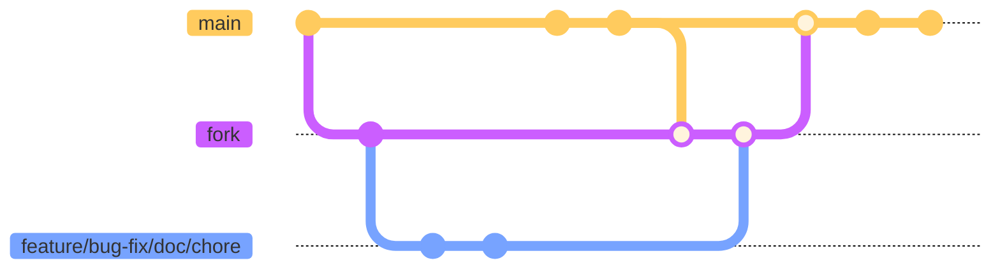

# Contributing

Thank you for your interest in contributing to the club's website! No matter how large or how small, we welcome all contributions made by students at Brooklyn College. Our club is community-driven and our goals are to help students improve their technical skills and further their education in computer science.

# Table of Contents

- [Contributing Guidelines](#contributing-guidelines)
- [Raising a Pull Request](#raising-a-pull-request-pr)
- [Branching Best Practices](#branching-best-practices-and-examples)
  - [Branch Name Examples](#branch-name-examples)
- [Commit Best Practicex](#commit-best-practices)
  - [Commit Message Examples](#commit-message-examples)
- [Glossary](#glossary)

# Contributing Guidelines

There are a few guidelines you should know while working on the website.

- Prioritize readability and reliability over speed and clever-coding
- Follow the style guidelines and auto-format your code with `Prettier`. This project uses single quotes whenever possible and backticks wherever necessary.
- We use functional React components in this project. If you have a class-based component, please refactor it to a functional component before opening a pull request.

# Raising a Pull Request (PR)

The workflow you should follow when contributing to this project can be seen in the diagram below (made using [mermaid](https://mermaid-js.github.io/mermaid/#/gitgraph?id=themes))



1. [Fork](https://docs.github.com/en/get-started/quickstart/fork-a-repo) the repository to have your own complete copy
2. [Clone](https://docs.github.com/en/repositories/creating-and-managing-repositories/cloning-a-repository) your forked copy of the repository to your local machine
3. Create a branch on your local machine to start working on your contribution

   Read our section on [branching](#branching-best-practices-and-examples) for best practices on managing branches in this project, and for branch name examples

4. Add and commit the changes you made to the copy of the repo on your local machine

   Read our section on [commits](#commit-best-practices) for best practices on making commits and writing commit messagess

5. Set up your `upstream` remote to point to the original [Club's GitHub repo](https://github.com/bc-compsci-club/club-connect). The `origin` remote should already point to your forked copy
6. [Pull](https://www.atlassian.com/git/tutorials/git-forks-and-upstreams) any changes/updates from the upstream repo into your local copy of the repo and resolve any conflicts
7. [Push](https://github.com/git-guides/git-push) your committed changes from your local copy of the repo to your remote forked copy
8. [Open a PR](https://docs.github.com/en/pull-requests/collaborating-with-pull-requests/proposing-changes-to-your-work-with-pull-requests/creating-a-pull-request-from-a-fork) with the changes from your forked copy to the main club repo.
9. Someone from the club will review your PR and will comment on any further changes that may be needed. Once everything looks good, we will approve the changes to be merged into the main repo
10. That's it! Thanks for contributing!

# Branching Best Practices and Examples

A branch should be given a name that is a **helpful description** of what you are contributing

A **_helpful description_** would include the following:

- Type of contribution (feature, bug-fix, documentation, chore)
- The approximate location of where the contribution will be included (filename, file directory)
- Short description of what you are contributing (avoid abbreviations not listed in the [glossary](#glossary))

Branch names should typically follow this format `<contribution-type><location><description>`

There is some flexibility with the arrangement of the `<location>` and `<description>` components whenever it would improve readability. The `<contribution-type>` will **always** be the first component in the branch name.

Branches should only have a single responsibility or single area of concern. ***A branch should focus on only one feature or one bug at a time*** and should not include work done on items unrelated to the original branch purpose/description.

If you discover an unrelated bug or you think of a new feature while working in your current branch, a separate branch should be created to deal with the newly discovered issue, apart from the current branch you are working on.

The ***exception*** to the above case would be if the new bug/feature discovered would need to be handled in order to continue progress on the current branch. In this case, you can give a **descriptive commit** message to the new issue in the current branch without having to create a separate branch.

## Branch Name Examples

We understand that it is ultimately impossible to separate contribution-types due to the nature of our work. Features will have bugs that need to be documented. We ask that you select the contribution-type that you believe best represents the importance or majority of the work that you are contributing.

For examples of `feature` branch names

```bash
# bad
feature-new-page
feature-add-event-func
feature-update-teammember-code

# good
feature-new-signup-page-for-clubmember-registration
feature-event-page-function-to-remove-past-events
feature-teammember-component-refactor-to-separate-file
```

For examples of `bug-fix` branch names

```bash
# bad
bug-fix
bug-fix-page-broken
bug-fix-wrong-var-name

# good
bug-fix-website-not-loading-in-local-dev-environment
bug-fix-signup-page-not-registering-clubmembers
bug-fix-about-page-component-variable-does-not-match-prop-value
```

For examples of `documentation` branch names

```bash
# bad
update-readme
doc-add-workflow-diagram
doc-fix-spelling

# good 
doc-include-contributing-section-in-readme
doc-contributing-add-workflow-diagram-for-PR
doc-fix-spelling-errors-in-readme
```

Most other tasks can fall under the `chore` contribution-type. For examples of `chore` branch names

```bash
# bad
chore-format-code
chore-add-comments
chore-remove-file

# good
chore-home-page-update-code-indentation
chore-add-descriptions-for-general-utils-functions
chore-remove-duplicate-contributing-file
```

# Commit Best Practices

Each commit should **focus on one action** and should have a descriptive commit message. Having large commits will make it difficult to debug any problems caused by your contribution as it will take more time to figure out exactly where the problem occurred. Smaller frequent commits will help separate concerns and isolate sections where bugs may arise. Small commits will also make it easier to perform rollbacks or cherry-pick certain features or fixes

## Commit Message Examples

```bash
# bad
"changed method"
"add events page, add newsletter page, remove help page, update signup page"

# good
"renamed general utils method 'userId' to getClubMemberId"
"create events page to list past and current events"
"create newsletter page to display monthly club fliers"
"remove unreachable help page"
"update signup page form to include field for discord name"
```

# Glossary

The following is a list of terms and abbreviations that are used throughout this project

- cs - Computer Science
- dev - Developer/Development
- doc - Documentation
- env - environment
- PR - pull request
- repo - repository

[Back to Top ^](#contributing)
